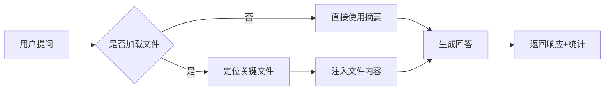
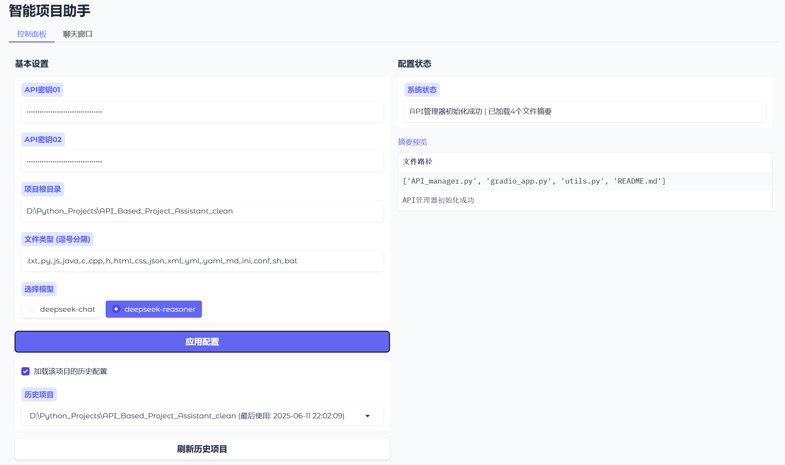
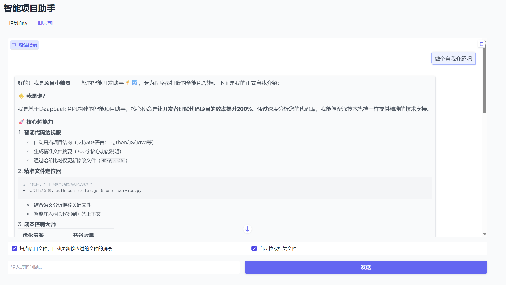
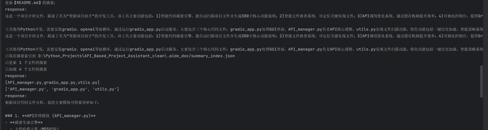

# 🧚 项目小精灵：智能项目助手

欢迎使用智能开发助手！我是您的项目小精灵，专为程序员打造的AI开发搭档。通过智能分析代码项目结构，我能帮助您快速理解代码逻辑、定位关键文件，让开发效率提升200%！

## 🎯 项目目的
我旨在**辅助程序员高效开发**，通过[DeepSeek API](https://platform.deepseek.com/)智能分析项目代码，我能提供：
- 精准的代码文件摘要（300字核心功能说明）
- 智能文件推荐（自动定位关键实现文件）
- API调用优化（缓存命中率90%+）
- 自然语言问答支持（理解技术问题上下文）

## ✨ 核心功能
### 1. 智能代码摘要引擎
- 自动扫描项目文件（自定义可扫描文件类型）
- 基于内容哈希的缓存机制（`API_manager.calculate_file_hash`）
- 仅更新修改过的文件（`API_manager.update_summary`）
- 摘要存储到`.aide_doc/summaries`目录

### 2. 智能文件推荐
- 根据问题定位关键文件（`API_manager.analyze`中的文件推荐逻辑）
- 自动读取并注入相关文件内容（一次最多5个关键文件）
- 智能编码检测（`utils.scan_project_files`使用`chardet`）

### 3. API优化系统


### 4. 可视化控制台
- Gradio网页界面（`gradio_app.py`实现）
- 双标签页设计：
  - **控制面板**：密钥管理+项目设置 
  - **聊天窗口**：技术问答+实时分析 
- 历史项目记忆（`projects_history.json`自动保存）

### 5. 智能问答系统
- 连续对话记忆（`chat_history`参数传递）
- 上下文感知（结合项目摘要和代码文件）
- 响应统计显示（时间/文件数/读取文件）

## 🚀 使用方式
### 快速启动
```bash
    pip install gradio openai chardet
    python gradio_app.py

```
浏览器打开 http://localhost:7860 ，启动图形化界面

### 操作流程
1. **配置页面**（控制面板）
   - 选择历史项目：
     - 自动填充信息
   - 或分析新项目：
     - 输入DeepSeek API密钥（建议输入两个不同密钥）[双密钥](#-注意事项)
     - 设置项目根目录（绝对路径）
     - 选择文件类型（默认`.py,.js,.java`等）
     - 点击"应用配置"初始化
   
2. **分析页面**（聊天窗口）
   ```python
   # 示例问题：
   "用户登录功能如何实现？"
   ```
   - 勾选选项：
     - [x] **扫描项目文件**：检测代码变更，对变更的代码文件生成新的摘要。（建议保持开启）
     - [x] **自动拉取相关文件**：（额外花费约70%的token）自动推荐与问题相关的最多5个**关键文件**并输入模型，辅助生成更精确的回答。
   - 点击"发送"获取解答

3. **历史管理**
   - 使用"刷新历史项目"加载过往配置
   - 选择历史项目自动填充路径

## 🔧 环境搭建
### 基础环境
```
Python 3.8+

依赖：gradio>=4.0, openai>=1.0, chardet
```

## ⚠️ 注意事项
1. **密钥**
   - 两个密钥分别执行不同操作（概括文件 | 回答问题），可以使用同一个密钥，但这样增加了[cache miss](https://api-docs.deepseek.com/zh-cn/news/news0802)的可能性，有可能产生不必要的api费用.
   - 历史配置加密存储于`history_information/`

2. **首次使用**
   - 首次勾选"扫描项目文件"时，扫描需较长时间（树状搜索文件 & 逐个文件生成摘要）
   - 摘要生成消耗API额度

3. **文件变更**
   - 修改代码后需勾选"扫描项目文件"
   - 自动更新`.aide_doc/summary_index.json`和`.aide_doc/summaries/...`

4. **路径规范**
   - 避免中文路径（可能引发编码问题）

## 🌟 项目特点
### 开发者友好设计
- **一键历史加载**  
  `refresh_history_projects`实现项目秒切换
- **智能忽略系统**  
  自动识别`.gitignore`规则（`utils.parse_gitignore`）

### 成本优化体系
| 优化策略        | 实现方式                          | 节省效果 |
|-----------------|-----------------------------------|----------|
| 双密钥分离      | 对话与摘要使用独立API密钥         | 30%成本  |
| 哈希缓存        | `hashlib.md5`内容比对             | 90%重复请求 |
| 精准文件加载    | 仅读取相关问题相关文件            | 75%token消耗 |

### 持久化存储
```tree
被访问过的项目的根目录/
├── .aide_doc/                  # 自动生成
│   ├── summaries/              # 详细摘要
│   └── summary_index.json      # 摘要索引（含文件哈希）
├── ...
...
```

## 💡 技术实现
### 核心代码文件
| 文件          | 功能说明                                                                 |
|---------------|--------------------------------------------------------------------------|
| `gradio_app.py` | 实现GUI界面/历史管理/聊天交互 (`handle_chat`处理对话流)                  |
| `API_manager.py`| API核心逻辑/摘要生成/缓存管理 (`update_summary`智能更新)                 |
| `utils.py`     | 文件扫描/编码检测/忽略规则 (`scan_project_files`递归处理)                |

### 智能问答流程
```python
# API_manager.analyze 核心流程
def analyze(user_input, chat_history, scan_files, load_files):
  1. if scan_files: 扫描项目 → 更新变更文件摘要
  2. 构建项目摘要概览
  3. if load_files: 定位关键文件 → 注入文件内容
  4. 结合摘要+文件内容生成回答
  5. 返回响应+统计信息
```


## 📁 项目结构
```
smart-dev-assistant/
├── history_information/        # 历史配置（自动创建）
│   └── projects_history.json   # 加密的项目配置记录
├── gradio_app.py               # 主界面（1400+行GUI逻辑）
├── API_manager.py              # API核心（摘要/问答/缓存）
├── utils.py                    # 文件扫描/编码处理
└── README.md                   # 项目文档
```

## 🚨 异常处理
- 文件读取异常：自动检测编码（`chardet.detect`）
- API调用失败：友好错误提示（`gradio_app`捕获异常）
- 路径错误：绝对路径校验（`os.path.exists`）

---

🧚 **项目小精灵提示**：  
修改代码后记得扫描更新｜首次使用推荐开启"自动拉取文件"功能！
